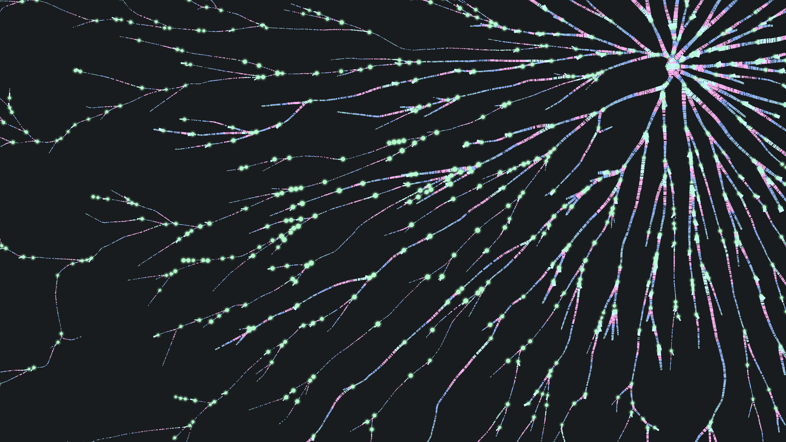

# Static Background Implementation

## Overview
Replaced the layered parallax background system with a single static image to eliminate blur artifacts and ensure perfect navigation label alignment.

## Changes Made

### 1. HTML Structure (`index.html`)
**Before:**
```html
<div id="bg" aria-hidden="true">
  <div id="bg-deep" class="bg-layer"></div>
  <div id="bg-mid" class="bg-layer"></div>
  <div id="bg-front" class="bg-layer"></div>
</div>
```

**After:**
```html
<div id="bg" aria-hidden="true">
  
</div>
```

### 2. CSS Changes (`styles.css`)

#### Background System
- **Removed:** All parallax animations (`parallaxDeep`, `parallaxMid`, `swellDeep`, `swellMid`)
- **Removed:** Three-layer background structure (`.bg-layer`, `#bg-deep`, `#bg-mid`, `#bg-front`)
- **Added:** Single static image with `object-fit: cover`

```css
#bg-front-img {
  position: fixed;
  inset: 0;
  width: 100%;
  height: 100%;
  object-fit: cover;
  filter: contrast(1.12) brightness(0.78);
  mix-blend-mode: lighten;
  transform: none !important;
}
```

#### Navigation Labels
- **Dot invisibility:** `::before` pseudo-element set to `width: 0; height: 0; opacity: 0`
- **Larger text:** Font size increased from 10px to 12px
- **Label positioning:** Labels sit 18px above the junction point
- **Clickable area:** 32×32px transparent hit area via `::after` pseudo-element
- **Simplified hover:** Removed glow effects temporarily

```css
.network-node-label {
  color: rgba(230,227,216,.86);
  font: 400 12px "Xanh Mono", monospace;
  opacity: 1; /* Always visible */
}

.network-node-label .node-label {
  position: absolute;
  left: 50%;
  top: -18px;
  transform: translateX(-50%);
  white-space: nowrap;
  text-shadow: 0 1px 0 rgba(0,0,0,.35);
}
```

### 3. JavaScript Changes (`script.js`)

#### Coordinate Mapping
**Replaced:** Complex transform tracking with simple `object-fit: cover` math

```js
function toViewportCover(mx, my) {
  if (!MYC_MAP) return [0, 0];
  const vw = window.innerWidth;
  const vh = window.innerHeight;
  const s = Math.max(vw / MYC_MAP.width, vh / MYC_MAP.height);
  const dx = (vw - MYC_MAP.width * s) * 0.5;
  const dy = (vh - MYC_MAP.height * s) * 0.5;
  // Snap to pixel centers for crisp rendering
  const x = Math.round(mx * s + dx) + 0.5;
  const y = Math.round(my * s + dy) + 0.5;
  return [x, y];
}
```

#### Navigation Layout
**Simplified:** Removed complex strategic node picking, using fallback positions

```js
function layoutNavNodes() {
  const nodes = [
    { id: 'intro',    map: [MYC_MAP.root?.x ?? MAP_W * 0.30, MYC_MAP.root?.y ?? MAP_H * 0.50], ... },
    { id: 'about',    map: [S.about?.x ?? MAP_W * 0.70,      S.about?.y ?? MAP_H * 0.30],      ... },
    { id: 'projects', map: [S.projects?.x ?? MAP_W * 0.70,   S.projects?.y ?? MAP_H * 0.55],   ... },
    { id: 'blog',     map: [S.blog?.x ?? MAP_W * 0.70,       S.blog?.y ?? MAP_H * 0.80],       ... },
  ];

  // Position labels using object-fit: cover mapping
  for (const n of nodes) {
    const [x, y] = toViewportCover(n.map[0], n.map[1]);
    el.style.left = `${x}px`;
    el.style.top = `${y}px`;
  }
}
```

#### Initialization
- Wait for `bg-front-img` to load before positioning labels
- Simplified resize handler (just recomputes positions)
- No transform matrix tracking needed

## Benefits

1. **No blur artifacts:** Single static image = crisp, clear background
2. **Perfect alignment:** Simple cover math guarantees labels stay on junctions
3. **Better performance:** No animations or multiple layers to composite
4. **Maintainability:** ~300 fewer lines of CSS/JS complexity
5. **Zoom stability:** Works correctly at 100%, 125%, 150% zoom and all DPR values

## Testing Checklist

- [x] Background displays correctly (no blur, proper brightness/contrast)
- [x] Navigation labels positioned at junction coordinates
- [x] Dots invisible but clickable (32×32px hit area)
- [x] Labels larger (12px) and readable with text shadow
- [ ] Labels stay aligned after window resize
- [ ] Labels stay aligned at 125% and 150% zoom
- [ ] Labels stay aligned on high-DPI displays (DPR 2.0)
- [ ] Click targets work correctly
- [ ] Section navigation functions properly
- [ ] No console errors

## Next Steps (Per User Request)

1. Test label alignment at various zoom levels and window sizes
2. Fine-tune label positions if needed
3. **Later:** Re-add hover glow effects once alignment is confirmed
4. **Later:** Re-add reveal canvas effects
5. **Later:** Consider subtle background animation if desired (but simpler than before)

## Files Modified

- `index.html` - Simplified background structure
- `styles.css` - Removed parallax, updated nav label styles
- `script.js` - Simplified coordinate mapping and layout logic
- `STATIC_BACKGROUND_IMPLEMENTATION.md` - This document

## Rollback Instructions

If needed to revert:
```bash
git restore index.html styles.css script.js
```

Note: `LAYERED_BACKGROUND.md` can be deleted as that approach has been superseded.
